*DESIGN AND VAILIDATION OF A PORTABLE PURTIBATION TREADMILL FOR BALANCE
RECOVERY RESEARCH*

Robert G. Knutson

Mechanical & Industrial Engineering

Montana State University

Bozeman, MT 59715

e-mail: RobertKnutson1@montana.edu

Corey A. Pew

Mechanical & Industrial Engineering

Montana State University

Bozeman, MT 59715

e-mail: Corey.Pew@montana.edu

Craig Shankwitz

Mechanical & Industrial Engineering

Montana State University

Bozeman, MT 59715

e-mail: Craig.Shankwitz@montana.edu

David Graham

Education, Health, & Human Development

Montana State University

Bozeman, MT 59715

e-mail: David.Graham7@montana.edu

Formatting Guide:
https://www.asme.org/publications-submissions/journals/information-for-authors/journal-guidelines/writing-a-research-paper

ABSTRACT: No more than 250 words

Perturbation Training is an emerging field of study that has been shown
to reduce injury rates associated with trips and falls in elderly
adults. In a typical training session, the user stands or walks on a
treadmill and is subject to a sudden, unexpected acceleration,
simulating a slip or trip in a laboratory-controlled environment. The
goal of this training is to improve the user’s ability to maintain and
recover balance in situations that can often lead to falls.

Traditionally, treadmills used for this are large, instrumented devices,
that are rigidly bolted to the floor. This presents a problem for
elderly patients with limited mobility and a lack of nearby facilities.
A portable treadmill would be able to serve a larger portion of the
at-risk population then current methods have allowed. We developed a
portable perturbation treadmill, capable of high intensity
perturbations. The final design features a tandem belt configuration,
individual belt control, and a minimal gap between the belts. Each side
of the system is fully redundant, each belt is capable of handling 100%
of the load. The belt speed is dictated by a custom
human-machine-interface and software suite, which allows for operators
with little programming experience to control the device. The design has
been fully validated and it will be used in multiple locations in an
upcoming field test. In this paper we will go over the design,
fabrication, and validation processes used to create this device.

I. INTRODUCTION

Falls are the most common and significant health threat among elderly
adults [1]. Nearly one out of every three people over 65 year old will
fall annually, and in half of these cases the falls are recurrent [2].
For adults over 80 this rate increases to nearly 50% [3]. The majority
of falls among otherwise healthy community dwelling older adults are due
to external perturbations, such as a trip or slip [1]. This can lead to
devastating fall related injuries. Specifically, hip fractures and
related complications are known to double the average mortality rate
over a period of 12 years, with the most significant risk in the first
year [4].

Falls in the elderly are generally not due to a single factor, rather
multiple factors that have a cumulative effect leading to an increase in
fall vulnerability [5]. As we age our bodies change. Muscle tone and
nerve conduction speeds decrease [6, 7]. Research has shown that nerve
responses to postural disturbances, which are the mechanisms that keep
the body upright and aligned, are slower in elderly adults. This results
in poor coordination between postural reflexes and voluntary movement
[8]. Age related muscle loss, known as Sarcopenia, is also a significant
risk factor. Fall rates are tripled for older adults that exhibit lower
extremity muscle weakness [9]. Accurate sensory information is required
to walk and maintain balance [10], specifically the nerves in the feet
have been shown to be of significant importance. As we age there is a
widespread increase in the activation threshold for cutaneous sensation
and joint proprioception [11]. This results in less sensation in the
feet and has been identified as a significant risk factor for
instability and falls [12].

Perturbation training has emerged as an effective way to reduce fall
injury rates in older adults [13]. During training, individuals are
subjected to sudden and unexpected motions in order to simulate a
real-world trip or slip conditions. Repeated exposure to this type of
training has been shown to improve stability control [13]. During a
training session, the user will stand or walk on a moveable surface such
as a platform or treadmill and will be exposed to a sudden and
unexpected acceleration. A typical training program consists of multiple
training sessions spread out over several weeks and each training
session consists of multiple trials with varying intensities. The
intensity of treadmill-based perturbation is varied by two factors, the
acceleration of the belts and the duration of the perturbation. In
current literature these values range from 3 m/s^2^ to 15 m/s^2^ and
0.2s to 0.5s for the acceleration and duration respectively [14-16].

Traditional perturbation devices suffer from the same flaw. Due to their
size, weight, and rigid mounting the user must come to the device. This
limits their usability especially for elderly adults with limited
mobility. By creating a lightweight and portable perturbation treadmill
(PPT), individuals in remote areas can be more easily trained. This has
the benefit of not only being able to serve a larger number of elderly
patients, but the location of training can be in a space more
comfortable for the user. This is an ancillary project for an upcoming
PHD dissertation that will examine the clinical outcomes of perturbation
training in remote rural areas. Our efforts were focused on creating the
treadmill that will be used in this study.

{empty}II. METHODS

_A. System Design Specifications_

The design of the PPT was guided by the desire to create a system
capable of high intensity perturbations while being operated by an
individual with minimal programming experience. The system was designed
to be capable of simulating trip or slip perturbations from a standing
or walking state. To accommodate the widest range of possible uses the
system was designed with the following parameters:

____
{empty}1) The system will be capable of achieving a maximum acceleration
of 12 m/s^2^ for a period of 0.3 seconds. This value was chosen based on
values in current literature [14-16] and the desire to minimize weight
whilst achieving a high intensity.

{empty}2) The system will be designed to accommodate a user up to 119
kg, which represents a 70 to 79-year-old male, in the 95^th^ percentile
[17].

{empty}3) The system will be designed with a dual belt configuration,
with individual belt control, and a minimal, obstruction free gap
between the belts. This was done to allow cross-over step and the
ability to preform perturbations on the left, right, or both belts.

{empty}4) The design must be able to fit within a standard pick-up truck
bed and be moved by two operators. This set limits on the size of the
device and its overall weight.

{empty}5) The device must be capable of operating on a variety of power
sources, such as 110 or 220 VAC with single, split or three phase power.
This done because power availability in the field is unknown.
____

_B._ _Load Inertia Calculations_

When a perturbation is performed the user is likely to experience two
types of motion. There could be a linear translation, as the user is
traveling along the treadmill, similar to a moving walkway, or the
perturbation could cause a rotation about the users center of mass. The
combination of these two types of motion was used to select an
appropriate motor using a reflected load inertia approach [18]. The goal
of this analysis was to find an equivalent rotational mass moment of
inertial that that is equal to the sum of the rotational and
translational components. Using this value, the required motor torque
was found.

First, the kinetic energy of objects rotating was found (Eq. 1). Next
the kinetic energy of objects moving linearly was calculated (Eq. 2).
Equation 3 was used to find an equivalent mass moment of inertia. The
final step was to calculate the torque required using Newtons Second Law
for rotation (Eq. 4).

[cols=",",options="header",]
|===
|

[latexmath]
++++
\[\text{KE}_{\text{rot}} = \frac{1}{2}\text{\ I\ }w^{2}\]
++++ |_(1)_
|

[latexmath]
++++
\[\text{KE}_{\text{lin}} = \frac{1}{2}\ m\ V^{2}\]
++++ |_(2)_

|

[latexmath]
++++
\[\text{KE}_{\text{ttl}} = \sum_{}^{}{\text{KE}_{\text{rot}} + \sum_{}^{}\text{KE}_{\text{lin}}}\]
++++ |_(3)_

|

[latexmath]
++++
\[T_{\text{motor}} = I_{\text{ttl}}\text{\ α}\]
++++ |_(4)_
|===

The variables used in these equations are: latexmath:[$I$] the mass
moment of inertia, latexmath:[$w$] the rotational velocity,
latexmath:[$m$] the mass of the object, latexmath:[$V$] the velocity of
the object, and latexmath:[$\alpha$] the acceleration of the motor.

_C._ _Belt Width & Load Calculations_

Treadmill belts are a subset of conveyor belts, and both are
manufactured in the same facilities [19]. The main difference between
the two is that unlike conveyor belts, treadmill belts are typically are
typically thin, flexible, and are constructed with a fabric backing
[20]. The belts were sized to withstand the maximum torque output of the
motor. This was done to ensure that the belts would not be the weak
point in the system. The goal of this calculation was to find the
minimum belt width that will withstand the applied load. The following
procedure was based on an recommendations from Shigley’s Mechanical
Engineering Design [18]. First the centrifugal load as the belt travels
around the drum was determined (Eq 5). Next, the maximum allowable belt
tension in the tight side was calculated based on the breaking strength
of the belt (Eq 6). Using Eq. 6-7 the load on the slack side was
determined. Finally, the results of the previous equations were input
into Eq. 8 and a minimum belt width was determined. A diagram of the
forces used in this calculation has been included in Fig. 2.

[cols=",",options="header",]
|===
|

[latexmath]
++++
\[F_{c} = \gamma*b*V^{2}\]
++++ |_(5)_
|

[latexmath]
++++
\[F_{1} = b*F_{a}\]
++++ |_(6)_
|

[latexmath]
++++
\[F_{2} = F_{1} - \frac{T}{r}\]
++++ |_(7)_
|

[latexmath]
++++
\[e^{\left( \text{μθ} \right)} = \frac{F_{1} - \ F_{c}}{F_{2} - F_{c}}\]
++++ |_(8)_
|===

The variables used in Eqs. 5-8 are: latexmath:[$\gamma$] the mass per
unit area of the belt, latexmath:[$b$] the unknown belt width,
latexmath:[$V$] the maximum permissible belt speed, latexmath:[$F_{1}$]
the tension on the tight side of the belt, latexmath:[$F_{a}$] the
maximum permissible load on the belt per meter of belt width,
latexmath:[$F_{2}$] the tension in the slack side of the belt,
latexmath:[$T$] the applied torque, latexmath:[$r$] the radius of the
drum, latexmath:[$\mu$] the coefficient of friction between the belt and
the drum, and latexmath:[$\theta$] which is the arc of contact between
the belt and the drum.

_D._ _Belt Tracking_

Conveyor belt tracking is the process of aligning and controlling a
conveyor belt so that it stays on the correct path and is a critical
aspect of conveying system design [21]. There are multiple factors that
contribute to tracking accuracy including belt design, loading
characteristics, and system configuration. Inadequate tracking can
result in the destruction of the belt and poor performance of the
system. The most significant factor in belt tracking is the parallelism
of the drums and other components that contact the belt [22]. The drums
and rollers must be installed at right angles to the belt running axis.
Misalignment of these components will result in a net steering effect,
causing the belts drift away from the center of the pulleys. This is
because flat belts have a natural tendency to track towards the side
with the least tension [20].

The traditional way to track conveyor belts is to use a crowned pulley,
which has a convex, conical surface that is higher in the center then
the edges. This causes an imbalance in the forces within the belt and
results in a natural self-centering action [23]. The use of a crowned
pulley requires certain design criteria, notably the drum must be wider
than the belt. This is to allow the belt room to deviate from the center
of the pulley and not loose contact with the surface. The common
recommendation is that the drums are 1” or 10% wider than the belt,
whichever is greater [20, 24]. The Habasit Fabric Conveyor Belt
Engineering Guide suggests that lateral guides can a be used for belt
tracking in situations where other measure are not appropriate [20]. The
guide prevents lateral movement of the belt by a slot in the guide that
the belt rubs against. Guides are specific to a direction of travel
because corrections to belt tracking must be made before the belt
contacts the drum [20]. For devices that are intended to be operated in
two directions, forward or reverse, multiple guides are needed.

_E._ _Shaft Calculations_

The goal of this calculation was to determine a minimum acceptable shaft
diameter. The shafts needed to be sized as conservatively as possible
because they are made out of solid steel and contributes significant
weight to the device. The components connected to the shaft can be seen
in Fig. 3. The loading scenario that was considered for this analysis
was that the belts were stretched to their breaking point while the
motor is applying maximum torque. It is possible that an inexperienced
user could apply an excessive initial preload by overtightening the
belts, effectively stretching them beyond their rated strength. The
belts will not last long at this value, but it is important that the
rest of the treadmill will not be damaged if this were to happen.

When the shaft rotates the internal stresses will cycle between a
minimum and maximum value. This type of loading is known as a cyclic
alternating stress [18]. While many formulas exist to solve for the
shaft diameter the DE-Goodman failure criteria was selected to determine
the final shaft diameter because it is conservative [18]. The first step
in solving for this diameter was to generate shear and moment diagrams
based on the applied load and components connected to the shaft. Next,
the stress endurance limit for the shaft material was calculated (Eq,
9). This value effectively reduces the maximum allowable stress for a
rotating beam at a theoretical infinite number of cycles [18]. Finally,
the shaft diameter was found using the Distortion Energy Modified
Goodman failure criteria (DE-Goodman) accounting for stress
concentrations (Eq. 10) [18].

[cols=",",options="header",]
|===
|

[latexmath]
++++
\[S_{e} = \ k_{a}k_{b}k_{c}k_{d}k_{e}k_{f}{S'}_{e}\]
++++ |_(9)_
|

[latexmath]
++++
\[d = \ \left( \frac{16*n}{\pi}\left( \frac{\sqrt[2]{4\left( K_{f}M_{a} \right)^{2} + 3\left( K_{\text{fs}}T_{a} \right)^{2}}}{S_{e}} + \ \frac{\sqrt[2]{4\left( K_{f}M_{m} \right)^{2} + 3\left( K_{\text{fs}}T_{m} \right)^{2}}}{S_{\text{ut}}} \right) \right)^{\frac{1}{3}}\]
++++ |_(10)_
|===

The variables used in these Eq. 9 are: latexmath:[$S_{e}$]the endurance
limit at the point of interest, latexmath:[$k_{a}$] the surface
condition modification factor, latexmath:[$k_{b}$] the size modification
factor, latexmath:[$k_{c}$] the load modification factor,
latexmath:[$k_{d}$]the temperature modification factor,
latexmath:[$k_{e}$] the reliability factor, latexmath:[$k_{f}$] the
miscellaneous effects modification factor, and latexmath:[${S^{'}}_{e}$]
the rotary beam test specimen endurance limit. The variables used in Eq.
10 are: latexmath:[$d$] the diameter of the shaft, latexmath:[$n$] the
desired factor of safety, latexmath:[$S_{\text{ut}}$] the ultimate
tensile strength of the shaft material, latexmath:[$K_{f}$] fatigue
stress concentration factor for bending, latexmath:[$K_{\text{fs}}$]
fatigue stress concentration factor for torsion, subscripts a and m
represent midrange and amplitude components for bending and torsion.

{empty}III. RESULTS

_A. System Design_

The resulting PPT consists of three main components: 1) the HMI (Fig.
4), 2) the split belt treadmill (Fig. 5), and 3) a generator (XP13000EH,
DuroPower, Covina, CA, USA). The operation of the treadmill is
controlled with a microcontroller (Arduino Mega 2560, Arduino,
Somerville, MA, USA). Each treadmill belt connected to a dedicated motor
(CPM-MCVC-N0563P-RLN, Teknic, Victor, NJ, USA). The system weighs
approximately 181 kg (400 lbs) when fully assembled. Its outer
dimensions are 43” x 72” (1 x 1.8 m). Transport of the device is
facilitated by wheels in the front and handles in the back.

A generator was needed because the various places this treadmill will go
may not have adequate power. The motors are capable of operating on
standard 110 V power without the generator, but at a reduced speed.
Additionally, when a perturbation is triggered, the motors can draw up
to 15 amps. Due to the proximity of this value to the trip point of a
standard US breaker, a generator was included in the budget for this
project. A 50 ft (15.25 m) 6 AWG extension cord was used to supply power
from the generator to the treadmill. This allowed the generator to be
placed outside, reducing noise and noxious fume concerns. The extension
cord connects to a power input box on the treadmill (Fig. 6A), which
also serves as a connection point for the control wiring harness. A 10
ft (3 m) data cable connects the HMI to the treadmill. This allows for
flexible placement of the operator during training.

_B._ _Motor Selection_

There are three distinct rotational velocities present in the system.
The first set is the user which is rotating at a rate independent of all
other components in the system (Eq. 12,latexmath:[$w_{3}$]), the seconds
set includes the treadmill pulleys and driven timing pulley (Eq.
12,latexmath:[$w_{2}$]), and the third set includes the driving pulley
and the motor (Eq. 12,latexmath:[$w_{1}$]). The values for individual
components can be seen in appendix Table 1.

[cols=",",options="header",]
|===
|

[latexmath]
++++
\[\sum_{}^{}{\text{KE}_{\text{rot}} = \ \frac{1}{2}I_{p1}\ {w_{3}}^{2} + \ \frac{1}{2}I_{m}\ {w_{3}}^{2}{\frac{1}{2}I_{u}\ {w_{1}}^{2} + I}_{d}\ {w_{2}}^{2} + \frac{1}{2}I_{p2}\ {w_{2}}^{2}}\]
++++ |_(11)_
|

[latexmath]
++++
\[r_{d}\ w_{2} = \ r_{u}\ w_{1}\]
++++ |_(12)_

|

[latexmath]
++++
\[r_{p2}\ w_{2} = \ r_{p1}\ w_{3}\]
++++ |_(13)_
|===

The ½ factor for the treadmill pulley in Eq. 11 was eliminated because
there are two of them. Using Eq. 11 the total rotational kinetic energy
of the system was found. In order to simplify these equations further
all distinct rotational velocities were solved in terms of a velocity
ratio, as in all velocities were expressed relative to a single source
velocity, specifically the speed of the motor, latexmath:[$w_{3}$] (Eqs.
12, 13). A similar procedure was used for objects in translational
motion, where two distinct velocities are observed, the velocity of the
treadmill belt and the velocity of the timing belt. It was assumed that
the user is moving at the same speed as the treadmill belt.

[cols=",",options="header",]
|===
|

[latexmath]
++++
\[\sum_{}^{}\text{KE}_{\text{lin}} = \ \frac{1}{2}m_{u}\ {v_{u}}^{2} + \ \frac{1}{2}m_{b}\ {v_{u}}^{2} + \frac{1}{2}m_{\text{tb}}\ {v_{\text{tb}}}^{2}\]
++++ |_(14)_
|

[latexmath]
++++
\[{r_{d}v}_{\text{tb}} = \ v_{u}\ r_{p2}\]
++++ |_(15)_

|

[latexmath]
++++
\[v_{u} = r_{d}*w_{2}\]
++++ |_(16)_
|===

The total kinetic energy of the system was found buy summing he
rotational and translational components (Eq. 3). The results of these
calculations showed that the equivalent mass moment of inertia of the
system was 0.0172907 kg m^2^. The motor torque required to accelerate
these objects, at the stipulated 12 m/s^2^ acceleration multiplied by
5.6:1 gear ratio was found to be 30.5 Nm (Eq. 4). Based on this
information an AC servo motor capable of outputting 32.9 Nm was
selected.

_C._ _Belt Width & Initial Preload_

Equations 5-8 were solved for the unknown belt width, b. The mass per
unit area of the belt, latexmath:[$\gamma$] is listed as 2.3 kg/m^2^
[25]. The maximum velocity used in this scenario, latexmath:[$V$], is
3.2 m/s as computed by the maximum motor speed and the gear ratio
(5.6:1). The maximum permissible load on the belt per meter of belt
width is listed by the manufacturer as 15800 N/(m width) [25]. The
torque, latexmath:[$T$], was 180 N/m, which was calculated by
multiplying the maximum motor torque by the gear ratio. The radius of
the drum, latexmath:[$r$], is 0.076 m (3”). The coefficient of friction,
latexmath:[$\mu$], between the belt and the drum is listed by the
manufacturer as 0.22 for contact with a steel pulley [25]. The arc of
contact, latexmath:[$\theta$], is 180° or π rad for two identically
sized pulleys.

Plugging in known values and solving for the width of the belt yielded a
minimum width of 0.314m (12.377”). For belt longevity it is best not to
load belts to this value, otherwise degradation and delamination of the
belt splice will occur [24]. Therefore, a belt that was 0.45m (18”) was
selected. Now that a belt width had been determined Eq. 6 and Eq. 7 were
used to solve for the tension in the tight and slack side belts,
latexmath:[$F_{1}$] and latexmath:[$F_{2}$] respectively. The results of
this calculations showed that latexmath:[$F_{1}$] would be 4869 N and
latexmath:[$F_{2}$] would be 2445 N.

The initial preload is the minimum tension required in the system to
ensure that the belt does not slip against the drum. This was found by
taking the average of the latexmath:[$F_{1}$] and latexmath:[$F_{2}$]
values calculated previously and was found to be 3657 N. Since it is
difficult to gage forces while tightening the belts, this converted to a
length by using elongation data supplied by the manufacturer. The listed
breaking strength of the belt is 15800 N/m with a total elongation at
failure of 2% [25]. Using this value, assuming zero elongation at zero
load and a 0.45m (18”) wide belt that is 1.5m (90”) between centers, the
distance required to stretch the belts initially was determined to be
0.007593m (0.29”).

_D._ _Pulley Selection & Belt Tracking_

A crowned pulley could not be used as this would result in a minimum
51mm (2”) gap, and this was deemed unacceptable. Therefore, the design
necessitated the use of flat pulleys. Ideally these would have a small
diameter, as this would lower the load inertia significantly because
that four of them are needed. Small pulleys could not be used because
the bearing typically sits outside the outer edge of the pulley. In
order to minimize the gap between the belts a novel recessed bearing
approach was used where the bearing block fits within the outer confines
of the pulley, shown in the inner bearing location in Fig. 3. The
selected pulley have a 6” (0.152 m) outer diameter and was custom
manufactured by a commercial supplier (PCI, Alpena, MI, USA).

Since crowned pulleys could not be used secondary belt tracking measures
were taken. A guide machined out of acetyl homopolymer (Delrin, Dupont,
Wilmington, DE, USA), was installed on the top (Fig. 7A) and bottom
sides of the belt (Fig. 7B). This material was selected because it
provides a slippery, wear resistant surface [26]. No guides were
installed in the center as a large steel plate that ran between the
belts served as an effective guide (Fig. 8).

_E._ _Shaft Sizing_

The final design features a stepped shaft, where the shaft is not a
continuous size throughout its length (Fig. 3). This was done to reduce
overall weight and lower costs associated with larger bearings. The
first step in solving for the shaft diameter was to determine the
magnitude of the load. The belts have a maximum strength of 15800 N/m
[25]. Multiplying this by the width of the belt, 0.45m (18”) we arrived
at a total load of 7200 N. This is effectively doubled since both the
top and bottom belt share the load, bringing the total force on the
shaft to 14410 N.

Shear and moment diagrams were generated based on the components shown
in Fig. 3. AISI 1045 Cold Rolled Carbon Steel was selected to be the
shaft material with a listed ultimate tensile strength and yield
strength are 585 MPa and 450 MPa respectively [27]. Next, the stress
endurance limit at each location of interest (Fig. 9) was calculated
(Eq. 9). The minimum shaft diameter was calculated using the DE-Goodman
failure criteria (Eq. 10) [18]. For a rotating shaft subject to bending
and a constant torque the values for latexmath:[$T_{a}$] and
latexmath:[$M_{m}$] are zero [18]. latexmath:[$K_{f}$] and
latexmath:[$K_{\text{fs}}$] were determined with table lookups and a
calculated notch sensitivity factor [18]. The results of this analysis
can be seen in appendix Table 2.

_F._ _HMI Design_

The goal of the HMI (Fig. 4) was to minimize the amount of coding
required from the operator and provide a simple, easy to use interface.
The final design features various buttons and switches that the operator
can use to control speed of the belts. There are several notable
features of the HMI. The mode select switch can be used to dictate the
perturbation intensity desired from any of 5 predefined values. A center
detent potentiometer was selected to control the steady state walking
speed for walking perturbations. This type of potentiometer was
desirable as it provided tactile feedback when the belt speed is set to
zero. A three-position switch was used to control the specific belt the
perturbation was performed on. This allowed for the perturbation to be
performed on the left, right, or both belts. A push button switch
featuring a tactile click was used to trigger the perturbations. The
tactile click was important to provide feedback for when the switch had
been engaged, allowing the operator to know precisely when a
perturbation had been triggered. A large emergency stop (E-Stop)
pushbutton switch was used to shut down the treadmill in case of an
emergency. Various, multicolor light-emitting-diodes were also included
to provide status information.

At the core of the HMI is an Arduino Mega. This device serves two main
functions. It continuously monitors button states and controls the speed
of the motors. The selected motors can be controlled in multiple ways,
but the specific operating mode used was the “follow digital velocity
with bi-directional Pulse-Width-Modulated (PWM) input” [28]. This
allowed the motors to be controlled in forward or reverse by changing
the duty cycle of the PWM signal sent by the Arduino.

_G._ _Software Design_

The software was designed to be compatible with a wide range of
potential uses. Perturbation profiles can be either static, where the
belt speed profile is predefined, or dynamic, where the belt speed
profile is calculated based on the values read the HMI. The software
calculates dynamic profiles based in the acceleration, duration, and
position of the belt speed potentiometer. The resulting curve is
interpolated at a rate of 40 samples per second, 0.025 seconds between
samples, as a compromise between data fidelity and array size.
Extraneous values, such as when the speed between two consecutive values
is the same, are removed to reduce memory consumption.

Extensive testing showed that the Arduino lacked sufficient memory for
profiles longer than two seconds even after optimizing memory
consumption. To solve this problem a program written in MATLAB was
created to predefine the profiles, freeing significant storage recourses
on the microcontroller. The flow of the code was similar the dynamic
profile generation, but the result would be an array of speed and timing
values that would then be copied into the Arduino code. This freed
significant storage recourses on the microcontroller and offloaded the
computationally expensive tasks to a more powerful device.

There are several notable safety features included in the Arduino
program. If the E-Stop was but is no longer engaged and the belt speed
is not set to zero, then the software disables the motors. This was done
to prevent the belts from moving immediately when the E-Stop is
disengaged. Similarly, on initial startup, if the belt speed is not set
to zero, then the software disables the motors. This was done to prevent
the belts from moving when the system is first turned on. Both of these
faults are indicated by flashing lights on the HMI and can be cleared by
setting the belt speed back to zero. An interrupt service routine was
used to monitor the state of the E-Stop. This allowed the emergency stop
subroutine to occur regardless of the other tasks the microcontroller
was performing. Finally, the emergency stop subroutine used blocking
code, which prevents the execution of all other lines of code. This was
done to ensure that a button state change, or poor coding, could not
inadvertently move the belts.

_H._ _System Performance Testing_

Verification of performance consisted of two stages. First a human
analog was created to test initial system performance and safety (Fig.
10 Left). Next a human subject test was performed (Fig. 10 Right). To
characterize motion of the system, data was collected from this test
using an inertial measurement system (XSENS, El Segundo, CA, USA) and
compared to results in current literature.

The human analog was designed to match the reflected load inertia of the
target demographic. The analog consisted of bags of commercially
available gravel. The mass of the analog was determined by summing the
rotational and translation kinetic energies of the user, as outlined
previously. The resultant total kinetic energy was converted to a mass
using Eq. 2. and was found to be 132 kg (291 lbs).

The setup of the human analog test was as follows. First, a sheet of
expanded polystyrene was placed on the back of the treadmill to decrease
wear on the gravel bags and increase friction. Next, the gravel was
placed on top of the polystyrene. After all the bags had been placed the
belts were accelerated at a rate of 12 m/s^2^ up to a maximum speed of
3.3 m/s. Once this speed had been reached the belts then decelerated
back to 0 m/s at the same rate. The test was performed a total of 10
times for each belt and slow-motion video was recorded and checked for
slippage between the belt and drum. After the test the PPT was
disassembled, and components were examined for cracks and signs of
premature wear.

The human subject test was orchestrated by the PHD candidate who will be
using this treadmill. The test consisted of an undergraduate research
assistant, weighing approximately 80 kg who was prevented from falling
via a climbing harness connected to an overhead crane (Fig. 10 Right).
From zero initial velocity an acceleration of 12 m/s^2^ was induced for
0.3 seconds and then decelerated back to zero over seven seconds. Motor
diagnostic data was collected during the test to assess torque
utilization and system performance.

DISCUSSION

We developed a novel dual belt perturbation treadmill capable of
preforming high intensity perturbations. The speed of each belt can be
independently controlled via a custom software and HMI. It features a
dual belt configuration where the speed of each belt can be
independently controlled. The gap between the belts is approximately
0.25” (6.35 mm) and there are no obstructions between the belts allowing
for crossover gate.

_A. System Design_

The physical design of the system was able to meet or exceed the
specified objectives in all but one category. The weight of the system
exceeded initial expectations. Nearly half of the overall weight is from
drivetrain components such as the pulleys, shafts, and drums. Although
lightweight alternatives were considered, budget constraints dictated
the use of heavier components. The physical areas of success were the
outer dimensions of the treadmill, which will be able to fit within the
confines of a standard truck bed [29].

_B. System Performance Testing_

Initial device testing showed that the motors would shut down during
hard deceleration periods. This when the motors are resisting the motion
of a load they act as generators, feeding voltage back into the system.
The selected motors have a feature to deal with this, but it can easily
become overwhelmed with high inertia loads. This is a safety feature
which prevents the motors from damage in this scenario. This was an
anticipated issue, and a simple solution was found. A breaking resistor
(RES 255, Teknic, Victor, NJ, USA), was installed which converts that
excess energy into heat (Fig. 6B). This solved the problem, and no
overvoltage faults were observed after this addition.

Results from the human analog test indicate that the device is capable
of handling a user up to 119 kg. At the conclusion of this test the
device was disassembled and checked for cracks and signs of premature
wear. No abnormalities were found so testing proceeded to the next
stage. Motion capture data from the human subject test showed a maximum
trunk deflection of 26.9° which is similar to the results of previous
studies [30, 31], the data collected in this test can be seen in
appendix Table 3. During this test the motor used a maximum of 40% of
available torque, which was less then initial estimates. At the
conclusion of the testing phase the treadmill was disassembled and
examined for excessive wear and no abnormalities were found.

{empty}IV. CONCLUSION

This work outlined the design and testing of a novel split-belt
perturbation treadmill. The system allows for high intensity
perturbations to be preformed while standing or walking with independent
control of each belt. The system has been fully validated and will be
used in multiple locations in an upcoming field test.

V. ACKNOWLEDGEMENTS

Funding for this project was provided by a grant FIND GRANT INFO

{empty}VI. APPENDIX

[cols=",,",options="header",]
|===
|*Item* |*Symbol* |*Value*
|User |

[latexmath]
++++
\[m_{u}\]
++++ |119 latexmath:[$\text{kg}$]
| |

[latexmath]
++++
\[I_{u}\]
++++ |12 latexmath:[$\text{kg\ }m^{2}$]
|Timing Belt |

[latexmath]
++++
\[m_{\text{tb}}\]
++++ |0.4626 latexmath:[$\text{kg}$]
|Treadmill Belt |

[latexmath]
++++
\[m_{b}\]
++++ |3.47 latexmath:[$\text{kg}$]
|Drum |

[latexmath]
++++
\[I_{D}\]
++++ |0.041833 latexmath:[$\text{kg\ }m^{2}$]
|Driven Pulley |

[latexmath]
++++
\[I_{p2}\]
++++ |0.138179 latexmath:[$\text{kg\ }m^{2}$]
|Driving Pulley |

[latexmath]
++++
\[I_{p1}\]
++++ |0.000104 latexmath:[$\text{kg\ }m^{2}$]
|Motor |

[latexmath]
++++
\[I_{m}\]
++++ |0.0019 latexmath:[$\text{kg\ }m^{2}$]
|===

Table 1. Summary of masses and moments of inertia for motor selection
calculations.

[cols=",,,,,,,",options="header",]
|===
|*Area of Interest* |*Type of Stress Concentration* a|
*Stress Endurance Limit,* latexmath:[$\mathbf{S}_{\mathbf{e}}$]

**(**latexmath:[$\mathbf{\text{Mpa}}$]*)*

|**Bending Moment (**latexmath:[$\mathbf{\text{Nm}}$]*)* |**Torque
(**latexmath:[$\mathbf{\text{Nm}}$]*)* a|
*Calculated Minimum Diameter*

**(**latexmath:[$\mathbf{m}$]*)*

|**Final Diameter (**latexmath:[$\mathbf{m}$]*)* |*Factor of Safety*
|Inner Bearing Shoulder |Shoulder Fillet |175.8 |181.0 |0 |0.0239
|0.0254 |1.2

|Inner Sprocket Keyway |Keyway |169.6 |256.6 |90.16 |0.0329 |0.0349 |1.4

|Outer Sprocket Keyway |Keyway |164.7 |671.4 |90.16 |0.0421 |0.0445 |1.2

|Driven Pulley Keyway |Keyway |164.7 |287.3 |180.32 |0.0334 |0.0445 |2.4

|Outer Bearing Shoulder |Shoulder Fillet |175.8 |120.3 |0 |0.0209
|0.0254 |1.7
|===

Table 2. Summary of shaft sizing results.

[cols=",,,,,",options="header",]
|===
| |*Trunk Flexion Angle (deg)* | | | |
| |*P1* |*P2* |*P3* |*P4* |*P5*
|*Max Velocity* |*1.5 m/s* |*1.5 m/s* |*2.6 m/s* |*3.6 m/s* |*3.6 m/s*
|T1 |17.2 |21.5 |29.9 |29.6 |23.1
|T2 |16.5 |18.6 |28.8 |30.5 |26.3
|T3 |24.6 |15.9 |28 |31.4 |28.5
|T4 |16.8 |16.4 |23.7 |31.6 |29.2
|T5 |22.2 |16.3 |23 |35.5 |26.2
|T6 |14.4 |19.6 |21.7 |28.3 |29.8
|T7 |19.6 |18.2 |21.5 |29 |26.5
|T8 |18.2 |16.8 |20.2 |33.9 |23.7
|T9 |14.2 |17.7 |21.2 |29.8 |28.6
|T10 |15.2 |14.3 |19 |33.2 |27.5
|*Min* |*14.2* |*14.3* |*19* |*28.3* |*23.1*
|*Max* |*24.6* |*21.5* |*29.9* |*35.5* |*29.8*
|*AVG* |*18.1* |*17.6* |*23.8* |*31.4* |*26.9*
|*STDEV* |*3.2* |*2.0* |*3.6* |*2.2* |*2.1*
|===

____
Table 3. Trunk deflection data from human testing.

The columns denoted by P indicate the perturbation intensity, with 5
being the highest.

The rows denoted by T indicate the specific trial number.
____

REFERENCES

https://www.molbelting.com/belts/2AW5-0BL-SB

https://www.dupont.com/brands/delrin.html

https://www.azom.com/article.aspx?ArticleID=9153

https://www.motortrend.com/features/shortbed-longbed-pickup-trucks/

{empty}1. Rubenstein, L.Z., _Falls in older people: epidemiology, risk
factors and strategies for prevention._ Age and Ageing, 2006.
*35*(suppl_2): p. ii37-ii41.2. Moylan, K.C. and E.F.J.T.A.j.o.m. Binder,
_Falls in older adults: risk assessment, management and prevention._
2007. *120*(6): p. 493. e1-493. e6.3. Sattin, R.W.J.A.r.o.p.h., _Falls
among older persons: a public health perspective._ 1992. *13*(1): p.
489-508.4. Katsoulis, M., et al., _Excess mortality after hip fracture
in elderly persons from Europe and the USA: the CHANCES project._ 2017.
*281*(3): p. 300-310.5. Pfortmueller, C.A., et al., _Fall-related
emergency department admission: fall environment and settings and
related injury patterns in 6357 patients with special emphasis on the
elderly._ 2014. *2014*.6. Berg, R.L. and J.S. Cassells, _Falls in older
persons: risk factors and prevention_, in _The second fifty years:
Promoting health and preventing disability_. 1992, National Academies
Press (US).7. Melzer, I., I. Kurz, and L.I.J.C.b. Oddsson, _A
retrospective analysis of balance control parameters in elderly fallers
and non-fallers._ 2010. *25*(10): p. 984-988.8. Stelmach, G.E., et al.,
_Age, functional postural reflexes, and voluntary sway._ 1989. *44*(4):
p. B100-B106.9. Landi, F., et al., _Sarcopenia as a risk factor for
falls in elderly individuals: results from the ilSIRENTE study._ 2012.
*31*(5): p. 652-658.10. Quigley, P.A., et al., _Exercise interventions,
gait, and balance in older subjects with distal symmetric
polyneuropathy: a three-group randomized clinical trial._ 2014. *93*(1):
p. 1-16.11. Kokmen, E., R.W. Bossemeyer Jr, and W.J.J.J.o.G. Williams,
_Quantitative evaluation of joint motion sensation in an aging
population._ 1978. *33*(1): p. 62-67.12. Lord, S.R., H.B. Menz, and C.
Sherrington, _Falls in Older People_, in _Osteoporosis in Clinical
Practice: A Practical Guide for Diagnosis and Treatment_. 2004, Springer
London: London. p. 93-99.13. Pai, Y.-C., et al., _Perturbation training
can reduce community-dwelling older adults’ annual fall risk: a
randomized controlled trial._ 2014. *69*(12): p. 1586-1594.14. McCrum,
C., et al., _Older adults demonstrate interlimb transfer of reactive
gait adaptations to repeated unpredictable gait perturbations._ 2020.
*42*(1): p. 39-49.15. Golyski, P.R., et al., _Onset timing of treadmill
belt perturbations influences stability during walking._ 2022. *130*: p.
110800.16. Sessoms, P.H., et al., _Method for evoking a trip-like
response using a treadmill-based perturbation during locomotion._ 2014.
*47*(1): p. 277-280.17. Fryar, C.D., et al., _Anthropometric Reference
Data for Children and Adults: United States, 2015-2018._ Vital &amp;
health statistics. Series 3, Analytical and epidemiological studies,
2021(36): p. 1-44.18. Nisbett, K. and R. Budynas, _Shigley's Mechanical
Engineering Design, 10th Edition_. 2015.19. _Treadmill Belts Suppliers_.
Thomas.20. _Fabric Conveyor Belts Engineering Guide_. Habasit AG.21.
spantechllc, _Guide to Conveyor Belt Tracking | Span Tech %J Span Tech
Conveyors._ 2022.22. Egger, M., K.J.J.M.E. Hoffmann, and Automation,
_Tracking of flat belts._ 2012. *2*: p. 27-36.23. Egger, M., K.
Hoffmann, and F.-W.T. Wien. _Lateral running of flat belts: The angled
conical pulley_. in _Int. Conf. Mechanism and Machine Science_. 2007.24.
_Belt Conveyors for Bulk Materials_. 7th ed. 2020: CEMA.25. _Product
Specification Data Model 2AW5-0BL-SB_. 2020; Available from: .26.
_Delrin®_. Available from: .27. _AISI 1045 Carbon Steel (UNS G10450)_.
2013 June 30, 2022]; Available from: .28. _CLEARPATH MOTORS AC INPUT,
INTEGRAL HORSEPOWER_. Teknic Inc.29. Jones, K. _Truck Bed Sizes_. 2021;
Available from: .30. Aviles, J., et al., _Improvement in trunk
kinematics after treadmill-based reactive balance training among older
adults is strongly associated with trunk kinematics before training._
2020. *113*: p. 110112.31. Feldman, A.G., et al., _Changes in the
referent body location and configuration may underlie human gait, as
confirmed by findings of multi-muscle activity minimizations and phase
resetting._ 2011. *210*(1): p. 91-115.

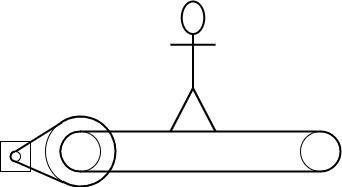

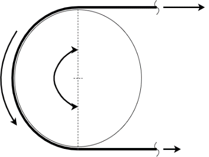

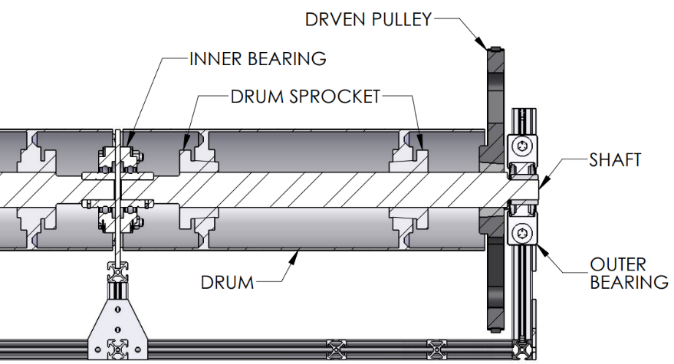

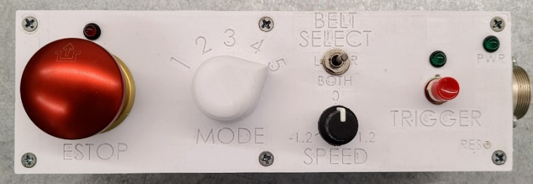

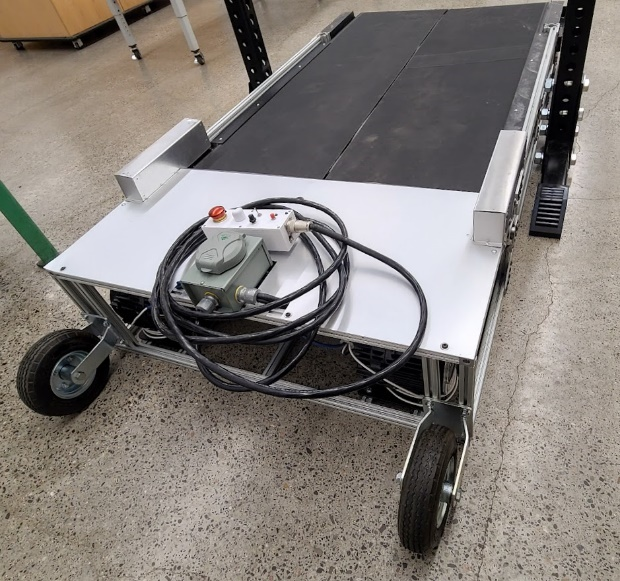

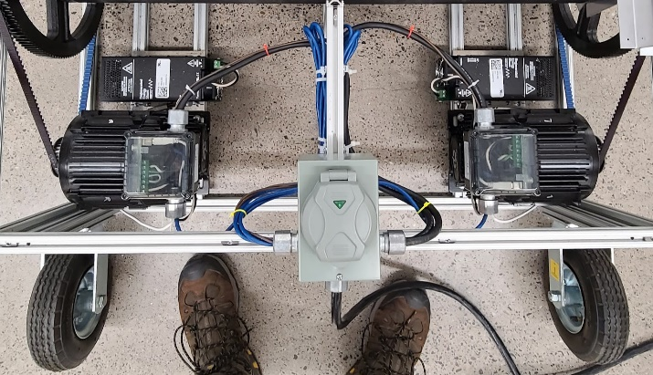

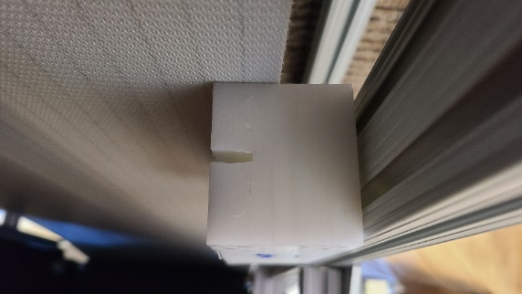

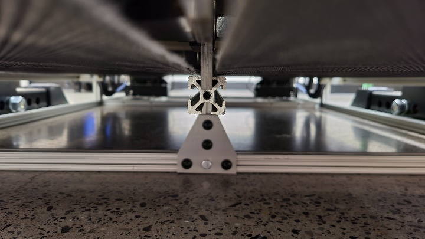

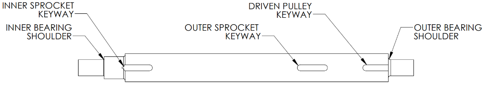

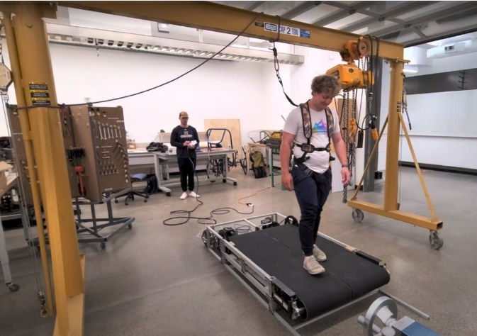

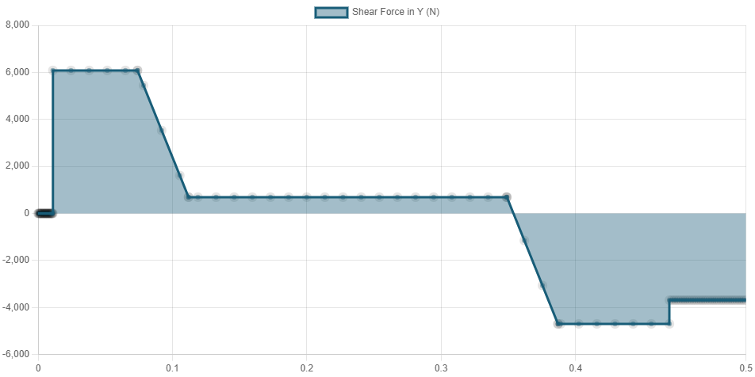
