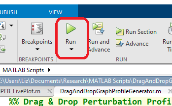
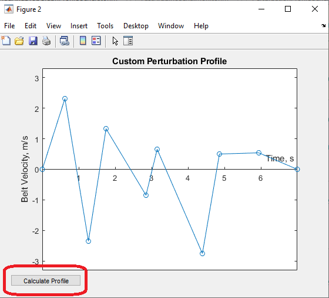
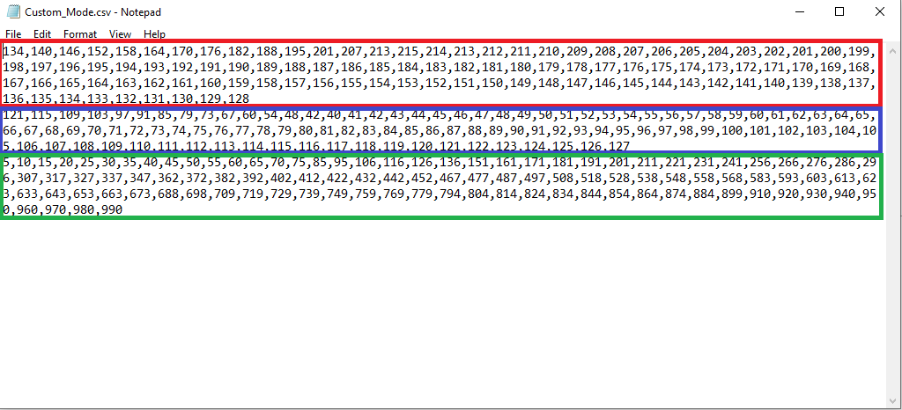

= Directions for Drag & Drop Profile Generator

This software was designed to be as user friendly as possible by using
on-screen buttons and popups to allow for the creation of custom,
complex, perturbation profiles.

This was built in MATLAB R2021a. Newer version will work, older versions
may or may not.

== Quick Start Guide:

[arabic]
. Run the MATLAB program and enter the number of points and total
perturbation time in the first two popups.
. Drag the points on the plot wherever you want.
. Click the calculate button to create verification plots and a CSV file
that contains motor speed and timing values.
. Paste these values into the Arduino code and you’re done!

== Instillation:

Download the source code for the entire project by clicking on the green
code button in the main project folder. This will download all files
used in this project.

Alternatively,
go to a specific file you are interested in and click the copy raw
contents button which can then be pasted into a blank MATLAB sketch.

== Use:

[arabic]
. Open the DragAndDropProfileGenerator.m file in MATLAB if you decided
to download the entire directory.
. Click
the run button to start the program. If you don’t see it click somewhere
in the code and it should appear.
. The
first popup will ask you to enter the number of points you need. Each
point is a moveable item, the minimum recommended is three, but you can
use as many as you want.
. image:Images/media/image6.png[image,width=288,height=178]The
second popup is going to ask you how long the total perturbation should
last in seconds. The is no minimum or maximum, so choose whatever you
like, but be as close to your desired total time as possible as it makes
the following graphs easier to read.
. A
graph will be displayed based on the number of points you entered and
the total duration. On this graph each point, indicated by the blue
circle, is a draggable item that can be moved anywhere desired. The
limits on the y-axis are based on the maximum belt speeds for the motor
input voltage (220 volt in the images below).
. Once
you have dragged the points to wherever you want them, click the
Calculate Profile button in the lower left corner of the screen.
Clicking this button will result in the function you generated being
converted into speed and timing values that can be used to control the
motors.
. A figure containing three graphs will be generated when the calculate
profile button is clicked.
[loweralpha]
.. The top graph displays result of interpolating the function you
created. This can be used to verify that the generated points match up
with the original function.
.. The second graph is the result of calculating the PWM values that the
treadmill software uses to control the motors. This can be used to make
sure the resulting graph matches the interpolated result. Some data
fidelity is lost in this step because each data point is converted to a
number between 0 and 255.
.. The third graph displays the optimized PWM array. This should match
the calculated PWM values in the graph above it, but with duplicate
points removed. This step significantly reduces the amount of storage
the profile will use on the Arduino, with no loss in data fidelity.
.. It is important to note that the original drag and drop profile can
still be modified, and the graphs will update when the calculated
profile button is clicked.

____

____

[arabic, start=8]
. The final step is to copy the resulting speed and timing values into
the Arduino code.
[loweralpha]
.. Clicking the calculate profile button also resulted a file named
Custom_Mode.csv being created in the folder the MATLAB script is
currently running in.
.. Open this file with Notepad or similar, but do not use Excel. Using
Excel will result in all the data being put into rows and columns and
make it much more difficult to paste into the Arduino code.
.. Copy the PWM and timing values into the Static Profile Arduino
software, using the following format. Different sections can be
identified by the large space following the last entry.
[lowerroman]
... The first section contains the speeds for the left motor. This
should be copied and pasted into the TestSpeed_L variable, where “_”
denotes the operating mode you want to save this in, it can be mode 1-5.
... The second section contains speeds for the right motor. Paste these
values into the TestSpeed_R variable.
... The
third section is the timing array, paste these values into the
TestTiming_ variable.
. Once
everything is pasted into the Arduino code, make sure the correct data
structure is used. As in curly brackets should encapsulate the data with
a semicolon at the end.
. Upload the code to the board and that’s it. Congratulations! Great
Job!

== Variables You Can Modify in the Code:

There are only two variables you can change in the code; they are the
data points per second (DPS) and the motor voltage.

* DPS controls how many data points per seconds are created as a result
of interpolating the function you generated. More data points means a
closer approximation but significantly impacts the storage required on
the Arduino. 40 DPS is a good starting point, that equates to 0.025
seconds per point, which is imperceptible to most people.
* Voltage dictates how to scale the PWM values to the minimum and
maximum motor speeds. This value should match whatever the motor is
going to be connected to and can be either 110 or 220.
